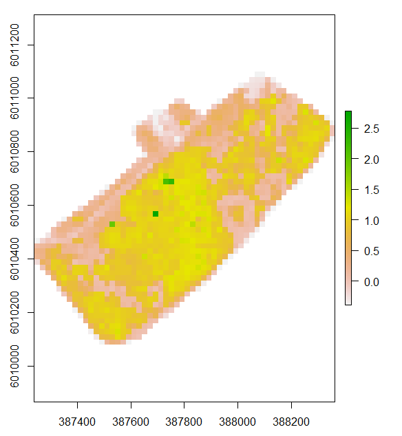

## Plot Data Analysis

 This work is licensed under a <a rel="license" href="http://creativecommons.org/licenses/by-nc/4.0/">Creative Commons Attribution-NonCommercial 4.0 International License</a>.

The following scripts and project use an area based approach to model to predicted canopy fuel load (CFL) across a forested landscape impacted by the Mountain Pine Beetle (*Dendroctonus ponderosae* Hopkins).

20 base plots from the foothills region of Alberta provide the on the ground data, while 8 flights of RPAS LiDAR cover the larger landscapes.

Upon the construction of a basic linear model, the following map of predicted CFL can be generated by inputting the max return of LiDAR based off a normalized vegetation dataset.

{width="548" height="479"}
